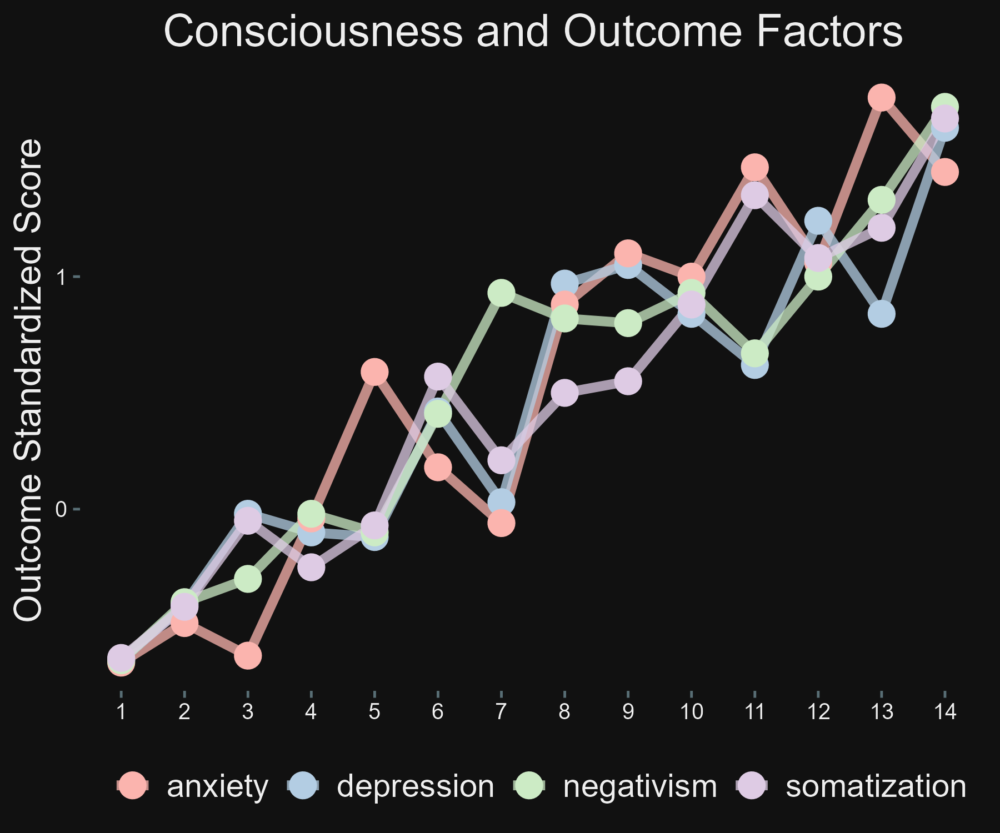
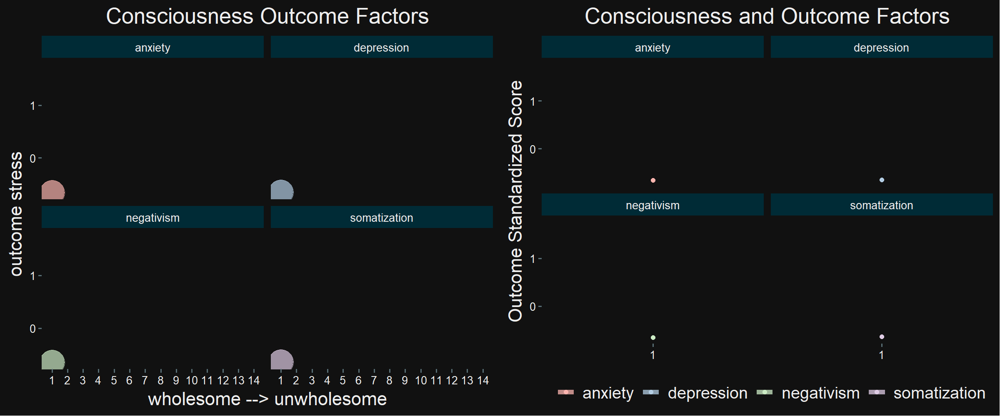

```{r setup, include=FALSE}
knitr::opts_chunk$set(echo = TRUE)
```

# **Unwholesome consciousness as a predictor for depression and anxiety**

## **Introduction**

I conducted a cross-sectional psychodiagnostic research study in which I utilized Structural Equation Modeling (SEM) and Logistic Regression analysis. Through these methods, I transformed the collected data and identified two underlying factors: one related to wholesome consciousness and the other to unwholesome consciousness.

Subsequently, I formulated a statistical model that confirmed the perspectives on consciousness and the karma principle as seen in Indian and Chinese 'daily life' or Buddhist beliefs. This model also explored their impact on mental health factors such as depression and anxiety.

The interpretation of the statistical model revealed that the primary contributors to 'unwholesome consciousness', leading to mental suffering, are fundamental ignorance and 'desire'. This insight aligns with the framework of Theravada Buddhist Psychology/Philosophy. Therefore, this explanation rooted in Theravada Buddhist principles provides a meaningful understanding of the results obtained from my study.

*Keywords:* Theravada Buddhism, philosophy of mind, psychopathology, Rstudio, tidyverse, ggplot2, Rmarkdown, gganimate, magick

### **Consciousness_outcome PNG**



### **Consciousness_combined GIF**



Figure 2 is one of the animated visualizations I created of my analyses of data in my PhD-thesis I'm working on. The objective is to write an article in which I relate Theravada Buddhist Psychology of the Abhidhamma (Buddhist Psychology/ Philosophy of Consciousness) with Western scientific views on psychopathology. I've found already some interesting results. In my analyses It appears, for example, that unwholesome consciousness is a predictor for depression and anxiety as you can see in the visualizations I created recently.

